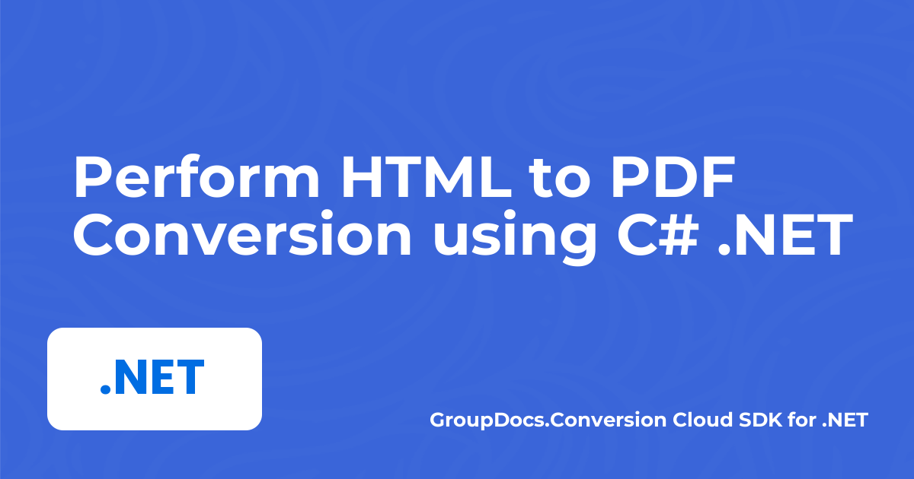
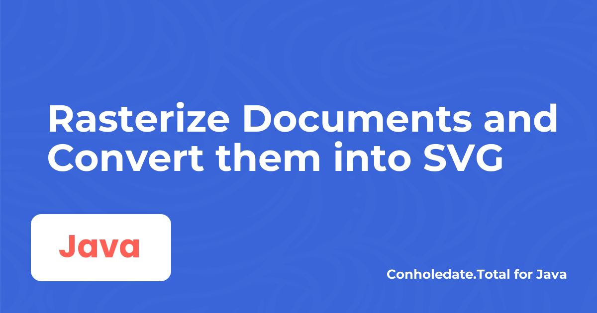
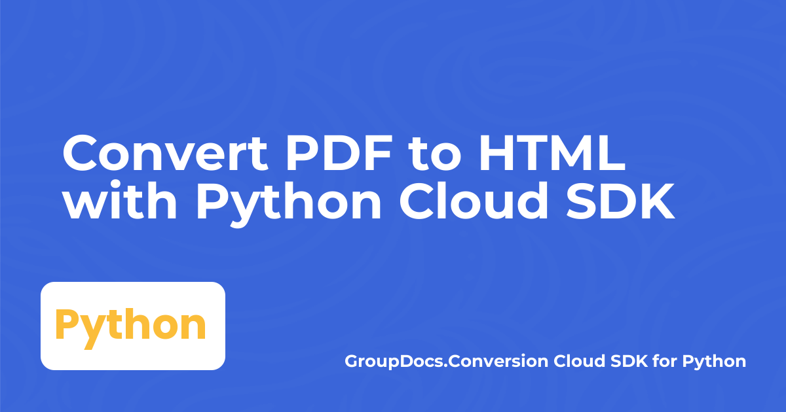
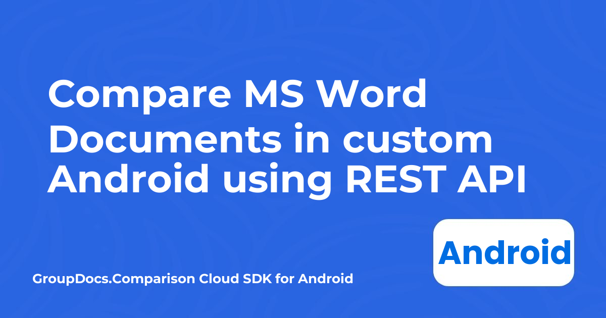

# Public Release Post Cover 

Generates banner image for blog posts.

## Setup

### 1. Create and activate a virtual environment

```bash
python -m venv .venv

# On Windows
.venv\Scripts\activate

# On Unix or MacOS
source .venv/bin/activate
```

### 2. Install dependencies

```bash
pip3 install -r requirements.txt
```

## Usage

```bash
python3 ./generate_cover.py --family "GroupDocs.Conversion Cloud SDK for Java"  --heading "Convert PDF to HTML with Python Cloud SDK" --alignment="Left" --output "../BannerImages/resultant.png"
```

- The `family` parameter determines the programming language specific label to be displayed in respective color.
- The `alignment` parameter specifies the indentation/alignment/positioning for the product family name on banner i.e. Left or Right.
- The `output` parameter is optional. If its provided, then the resultant image is saved at provided path i.e. `BannerImages`. But if the argument is not provided, the image is stored in `output` folder with name as:
    - blog-aspose-cloud-perl.png
    - blog-conholdate-com-net.png

## Preview
<div align="center">
  
  <br/>
  
  <br/>
  
</div>